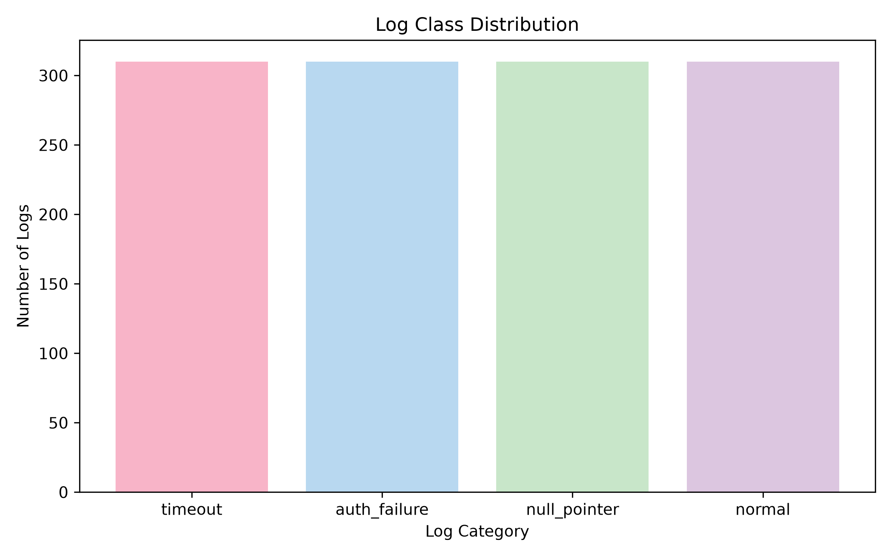
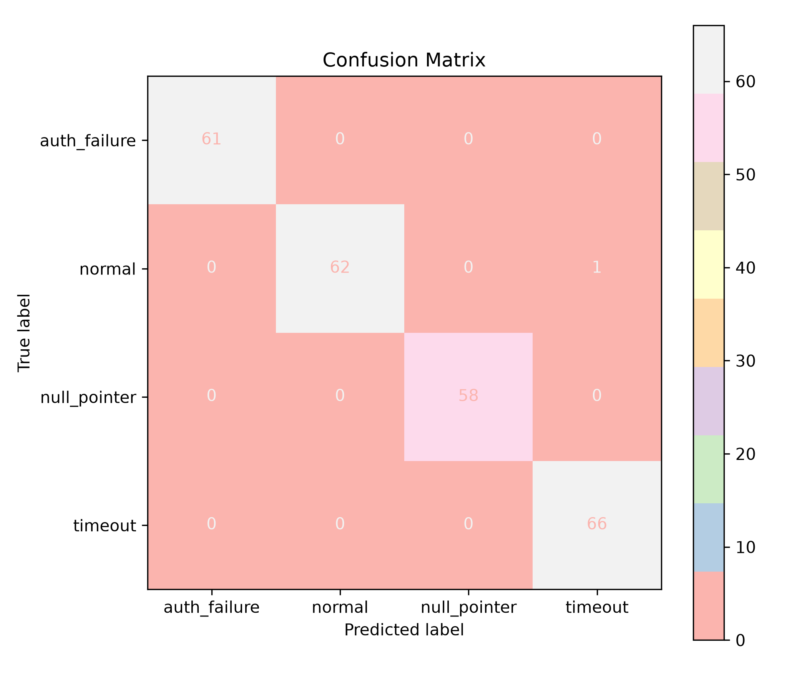
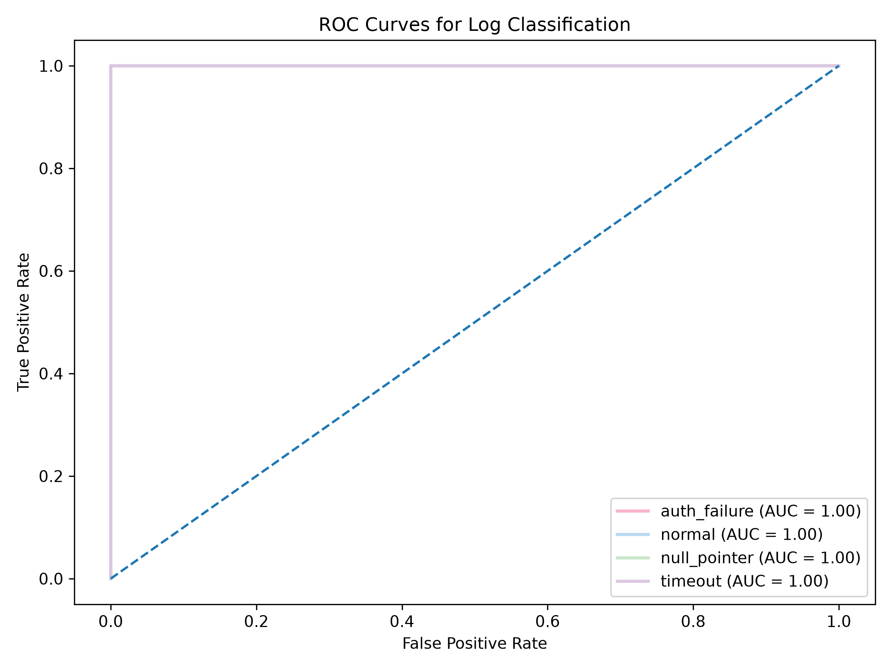
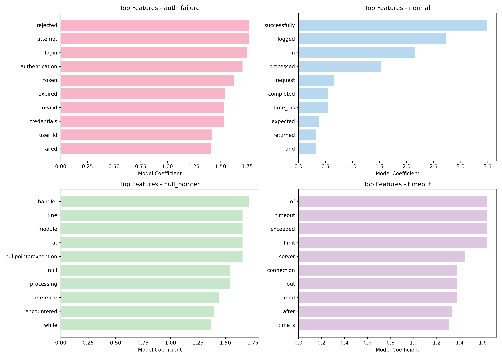

# Log ML Project

A machine learning project that classifies application and server log messages into four categories:

- `auth_failure`
- `normal`
- `null_pointer`
- `timeout`

## Project Overview

This project uses Natural Language Processing (NLP) and a Logistic Regression classifier to automatically identify the type of issue represented by a log message.

The log text is converted into numerical features using TF-IDF, and the resulting features are used to train the classification model.

## Dataset

The final combined dataset contains **1,240 labeled logs**.

Each class contains:

| Label | Number of Logs |
|---|---:|
| auth_failure | 310 |
| normal | 310 |
| null_pointer | 310 |
| timeout | 310 |
| **Total** | **1,240** |

The dataset is balanced across all four classes.

`generate_data.py` generates the synthetic log dataset used for training and evaluation.

## Machine Learning Pipeline

```text
Raw Logs
   ↓
Log Normalization
   ↓
Train/Test Split
   ↓
TF-IDF Vectorization
   ↓
Logistic Regression
   ↓
Predicted Log Category
```

## Log Normalization

Variable values such as user IDs, object IDs, and timing values are normalized before training.

Examples:

```text
user_4821   → user_ID
object_1234 → object_ID
500ms       → TIME_MS
30s         → TIME_S
```

This helps the model focus on meaningful words instead of memorizing individual numbers.

## Technologies Used

- Python
- Pandas
- Scikit-learn
- TF-IDF Vectorization
- Logistic Regression
- Joblib
- Matplotlib

## Model

The classification model is a **Logistic Regression** model trained using TF-IDF features.

The training process includes:

1. Loading the labeled log dataset
2. Normalizing variable values in log messages
3. Splitting the data into training and testing sets
4. Converting log text into TF-IDF features
5. Training the Logistic Regression classifier
6. Evaluating predictions using accuracy, confusion matrix, and classification report
7. Saving the trained model and vectorizer

## Training Results

The final dataset contains **1,240 logs**.

The data was divided into:

- Training set: **992 logs**
- Test set: **248 logs**

The model achieved:

### Training/Test Accuracy: 99.60%

The confusion matrix on the 248-log test set was:

```text
[[61  0  0  0]
 [ 0 62  0  1]
 [ 0  0 58  0]
 [ 0  0  0 66]]
```

Labels:

```text
['auth_failure' 'normal' 'null_pointer' 'timeout']
```

Only one test example was incorrectly classified.

## Unseen Data Evaluation

The model was also tested on a separate set of **32 newly created log messages** that were not part of the original training/test dataset.

### Accuracy: 96.88%

The confusion matrix was:

```text
[[7 0 0 1]
 [0 8 0 0]
 [0 0 8 0]
 [0 0 0 8]]
```

Labels:

```text
['auth_failure' 'normal' 'null_pointer' 'timeout']
```

Only **1 out of 32** unseen logs was misclassified.

### Visualizations

# Class Distribution

Shows the number of logs in each category


# Confusion Matrix

Shows the relationship between the actual labels and predicted labels.


# ROC Curves

Shows the ROC curves and AUC values for the four log categories.


# Top Features

Shows the most influential TF-IDF features for each category according to the Logistic Regression model.


### Classification Report

| Class | Precision | Recall | F1-score | Support |
|---|---:|---:|---:|---:|
| auth_failure | 1.00 | 0.88 | 0.93 | 8 |
| normal | 1.00 | 1.00 | 1.00 | 8 |
| null_pointer | 1.00 | 1.00 | 1.00 | 8 |
| timeout | 0.89 | 1.00 | 0.94 | 8 |
| **Accuracy** | | | **0.97** | **32** |

The only misclassified unseen log was:

```text
Log:
Unable to verify the user's identity

Actual:
auth_failure

Predicted:
timeout
```

This shows that the model performs strongly overall but can still struggle with ambiguous natural-language descriptions of authentication failures.

## Example Predictions

The final interactive prediction system correctly classified these new examples:

```text
Authentication failed because the password was rejected
→ auth_failure
```

```text
The server did not respond within the required time
→ timeout
```

```text
The application tried to access a missing object
→ null_pointer
```

```text
The request completed successfully
→ normal
```

## Feature Analysis

The trained model also provides the most influential features for each class.

### auth_failure

Important features included:

- rejected
- attempt
- login
- authentication
- token
- expired
- invalid
- credentials
- user_ID
- failed

### normal

Important features included:

- successfully
- logged
- processed
- request
- completed
- expected
- returned

### null_pointer

Important features included:

- handler
- line
- module
- nullpointerexception
- null
- processing
- reference
- encountered
- object_ID

### timeout

Important features included:

- timeout
- exceeded
- limit
- server
- connection
- timed
- out
- after
- time_S

These features help explain why the model associates certain words and patterns with each log category.

## Project Structure

```text
log-ml-project/
│
├── train_model.py
├── predict.py
├── evaluate_new_data.py
├── generate_data.py
├── generate_graphs.py
│
├── logs_labeled.csv
├── logs_augmented.csv
├── logs_combined_v2.csv
├── new_test_logs.csv
│
├── graphs/
│   ├── class_distribution.png
│   ├── confusion_matrix.png
│   ├── roc_curve.png
│   └── top_features.png
│
├── README.md
└── .gitignore
```

The trained `.pkl` model files and virtual environment are excluded from GitHub using `.gitignore`.

## How to Run

### 1. Create a virtual environment

```bash
python3 -m venv venv
```

### 2. Activate the virtual environment

On macOS/Linux:

```bash
source venv/bin/activate
```

On Windows:

```bash
venv\Scripts\activate
```

### 3. Install dependencies

```bash
pip install pandas scikit-learn joblib matplotlib
```

### 4. Train the model

```bash
python3 train_model.py
```

This trains the Logistic Regression model and generates the model and TF-IDF vectorizer files locally.

### 5. Evaluate on unseen data

```bash
python3 evaluate_new_data.py
```

This evaluates the trained model using the separate new test dataset.

### 6. Run interactive prediction

```bash
python3 predict.py
```

The program allows a user to enter log messages and receive a predicted category.

Example:

```text
Enter a log (or 'exit' to quit):
Authentication failed because the password was rejected

Prediction label: auth_failure
```

## Evaluation Metrics

The project uses the following evaluation metrics:

### Accuracy

Measures the overall percentage of correctly classified logs.

### Precision

Measures how often predictions for a class are correct.

### Recall

Measures how many actual examples of a class are correctly identified.

### F1-score

Provides a balance between precision and recall.

### Confusion Matrix

Shows which classes are being correctly classified and which classes are being confused with each other.

## Limitations

Although the model performs very well on the current datasets, several limitations remain:

- The dataset consists of generated/example log messages rather than a large collection of production logs.
- Some log messages can have ambiguous wording.
- Similar concepts can sometimes appear in different categories.
- The model may perform differently on completely different real-world logging formats.
- The current evaluation dataset is relatively small.

## Conclusion

This project demonstrates how traditional machine learning and NLP techniques can be used to automatically classify log messages.

Using TF-IDF features and Logistic Regression, the model achieved:

- **99.60% accuracy** on the held-out test set
- **96.88% accuracy** on separate unseen test data

The project also includes an interactive prediction system that can classify new log messages into four categories:

```text
auth_failure
normal
null_pointer
timeout
```

The results demonstrate that a relatively simple NLP pipeline can be effective for structured log classification while also showing the importance of evaluating a model on genuinely unseen data.